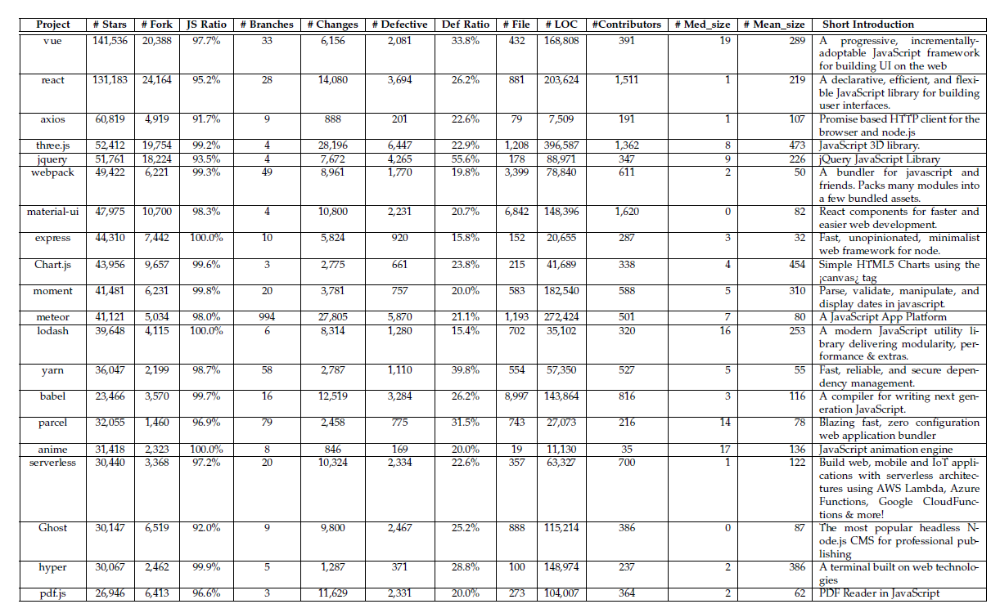

# Introduction and Motivation

"**Just-In-Time Defect Prediction on JavaScript Projects: A Replication Study**" has been accepted by TOSEM.

***Motivation***:

Change-level metrics features play an important role in Just-in-time defect prediction.
Prior proposed change-level features are programming language-independent, whether programming language-specific change-level features can further improve the performance of JIT approaches on identifying defect-prone changes is unknown.
In this paper, we propose five JavaScript-specific change-level features and conduct large-scale experiments to show the usefulness of language-specific features in identifying defects.

This repository contains the top-20 popular JavaScript projects collected from GitHub and labeled by [MA-SZZ](https://github.com/danielcalencar/ma-szz) algorithm.

# Project Selection

We use *JavaScript* as the keyword to search repositories on *[All GitHub](https://github.com/)* (i.e., 729,631 repository results returned).
Then, we filter these repositories by *JavaScript* language (i.e., 409,432 repository results returned).
Finally, we sort these queried projects by *most stars* in descending order.
To choose the most suitable projects, we set up the following inclusion criteria: (1) the ratio  that files ending with ``.js" account for the whole files in a project is no less than 90\% in a specific project;  (2)  projects should not be one of these types: tutorials, algorithm implementations written in JavaScript, the experience of a job interview and collections of useful code snippet {since they are not conceptually software project according to the [definition](https://en.wikipedia.org/wiki/Software\_development).
After filtering by these criteria, we pick up the top-20 most starred popular projects by January 10, 2020.

A summary of
these projects can be found in the follow figure.

# Data Introduction

In each csv file (i.e., a project), all commits are listed in **ascending** order by their commit timestamp.
Besides, 14 change-level features are considered in our paper, which are proposed by [Kamei et al.](https://www.researchgate.net/publication/260648765_A_Large-Scale_Empirical_Study_of_Just-in-Time_Quality_Assurance).

|Dimension    | Feature  | Description | 
|:-------:|:--:|:--------:|
|Diffusion  | NS  | Number of subsystems touched by the current change |
|| ND  | Number of directories touched by the current change |
|| NF  | Number of files touched by the current change | 
|| Entropy  | Distribution across the touched files | 
|Size  | LA  | Lines of code added by the current change |
|| LD  | Lines of code deleted by the current change |
|   | LT  | Lines of code in a file before the current change |
|Purpose  | FIX  | Whether or not the current change is a defect fix |
|Histroy  | NDEV  | The number of developers that changed the files |
|  | AGE  | The average time interval (in days) between the last and the change over the files that are touched |
| | NUC  | The number of unique last changes to the files |
|Experience  | EXP  | Developers experience, i.e. the number of changes |
|  | REXP  | Recent developer experience, i.e. the total experience of the developer in terms of changes, weighted by their age |
| | SEXP  | Developer experience on a subsystem, i.e. the number of changes the developer made in the past to the subsystems |
||||

Different programming languages have different characteristics. These aforementioned language-independent change-level features are only verified on projects developed by Java or C++, both of them are strongly type-aware programming languages. However, JavaScript is one of the most popular type-unaware programming language. 
Therefore, in addition to the 14 features from four dimensions, we also propose five JavaScript-specific features (i.e., HtmlCss, Strict, BDom, SO and TC) and group them into language-related dimension as shown in the following table. 
We introduce these features in detail as follows.

|Dimension    | Feature  | Description | 
|:-------:|:--:|:--------:|
|Language-Related    | HtmlCss  | Sum of HTML and CSS operations by the current change| 
||Strict|Switch between opening and closing “strict” mode by the current change|
||BDom|Sum of BOM (Browser Object Model) and DOM (Document Object Model) operations by the current change|
||SO|Number of special operator in JavaScript programming language by the current change|
||TC|Number of type check operations by the current change|

**HtmlCss**. HtmlCss represents HTML and CSS. The front end of a web application
consists of three important parts: JavaScript, HTML and CSS. Each of these parts has
different functions. That is, HTML defines content of web pages, JavaScript defines behavior
of web pages and CSS defines appearance the web pages. Therefore, a web application
will be considered a strong coupled application if a JavaScript file directly contains a few
scripts which interact with HTML script or CSS script. Although the three important
parts naturally need to interact with each other, there are many different state-of-the-art
development approaches that can build a connection among them. We calculate the number
of interactions between JavaScript and HTML or CSS to indicate the frequency of interaction
among them.

**Strict**. Strict mode is a special execution setting in JavaScript programming language,
which indicates the codes must be executed under strict conditions. In such a mode, scripts
will not be allowed to execute if they try to use undeclared variables. We can add “use strict”
to or remove “use strict” from the head of script or function to turn on or turn off the strict
mode. “use strict” is not a simple statement, but a literal expression. Switching the strict
mode means a exactly same JavaScript scripts may has different behaviour.

**BDom**. BDom is the abbreviation of BOM (Browser Object Model) and DOM (Document
Object Model). BOM enables JavaScript to interact with browser, while DOM enables
JavaScript to access all the elements (e.g., \<a>, \
, \
 and so on) of a HTML
document. BOM and DOM can help to adjust appearance environment, change browsing
behavior, detect browser capability, determine whether or not to use user agent, address
compatibility issues, access HTML elements and so on. BOM contains a few attributes,
including window, location, navigator, screen and history, while DOM contains one major
attribute: document. Therefore, these keywords are good indicators as the usage of BOM
and DOM.

**SO**. SO is short for Special Operators, which represents expressions unique to JavaScript
programming language. Although special operators (e.g., !==, === and void ) provide more
useful functionality, they may also cause ambiguous understanding. Take "EL!==ER" as
an example, “!==” is a two elements operator, which means left value (i.e., EL ) and right
value (i.e., ER ) are not absolutely equal. That is, EL is not equal to ER in terms of variable
data or variable type or both of them. In our paper, we consider the above-mentioned three
special operators since we think these operators may lead to logic errors in JavaScript scripts.

**TC**. TC is short for Type Check. Different from Java or C++ programming language,
JavaScript is type-unaware programming language. Improper usage of variable types will
cause the program to run abnormally and even produce unintended results. There are three
categories of type for JavaScript: data type (i.e., string , number , boolean and so on), object
type (i.e., Object , Date and Array ) and null object (e.g., null and undefined ). Different
types of variable can only be checked correctly with different operators. For example, we
use "typeof" to check data typed variables, while use "instanceof" to check object typed
variables. Therefore, we use the two operators to statistic the usage of type check operation.